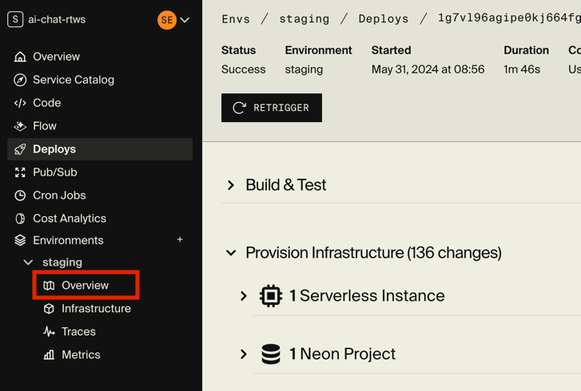
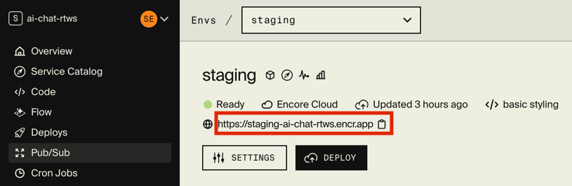
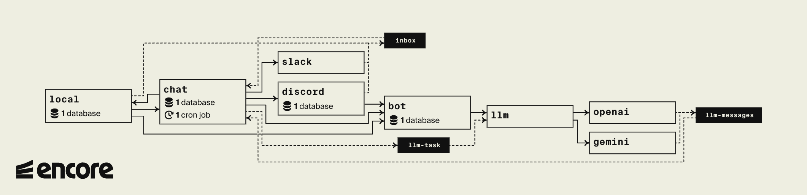

## AI Chat: Your (Witty) AI Companions


This application is your bridge between popular chat platforms like Discord and Slack and the powerful minds of LLMs like OpenAI and Google Gemini. It empowers you to build AI bots with unique personalities that can seamlessly engage in conversations with users.

### Features

* **Multi-platform Versatility:** Deploy your bots on Discord, Slack, or a local web-based chat for testing. Your digital puppets, your stage!
* **Personality is Key:** Craft engaging bots with distinct personas and conversational styles. Witty, wise, or just plain weird - the choice is yours!
* **LLM Buffet:** Pick and choose your LLM flavor - OpenAI and Google Gemini are ready to be your bots' brains.
* **Streamlined Development with Encore:** Built on Encore ([https://encore.dev/](https://encore.dev/)), simplifying development and deployment so you can focus on crafting brilliant bot personalities.

## Getting Started

### Prerequisites

* **Encore:** You'll need Encore to get started. Follow the installation instructions at [https://encore.dev/docs/install](https://encore.dev/docs/install).
* **OpenAI API Key:** To use OpenAI's models, grab an API key from [https://platform.openai.com/api-keys](https://platform.openai.com/api-keys).

### Run Locally

1. **Create Your Encore App:**
```bash
encore app create my-ai-chat --example=https://github.com/encoredev/ai-chat
```
(Feel free to replace `my-ai-chat` with a name that tickles your fancy)

2. **Set Your OpenAI API Key (Optional):**
```bash
cd my-ai-chat
encore secret set OpenAIKey --type dev,local,pr
```
Paste your OpenAI API key when prompted.

3. **Run Your App:**
```bash
encore run
```
Encore will build and start your application, providing you with a local URL (e.g., `http://127.0.0.1:4000`). Open this URL in your browser to see your creation - the local chat interface!


### Deploy to the Cloud

Ready to share your bots with the world? Encore makes deploying to a free testing environment a breeze:

```bash
git push
```

Encore will guide you through the deployment process and provide a link to your live application.



Once the deployment is complete, click Overview and copy the URL to see your bots in action on the web!



## Under the Hood

AI Chat is a microservices-based application, with each service handling a specific aspect of the chatbot ecosystem.
The services uses a combination of Encore APIs, pub/sub messaging, and WebSocket communication to orchestrate the flow of messages between chat platforms and LLM providers.
You can explore the services and their interactions in the [Local Dashboard](http://localhost:9400/).



### Key Components

* **Chat Service:** The orchestrator service, routing messages between chat platforms and LLM providers.
* **Discord Service:** Handles the integration with the Discord API.
* **Slack Service:** Manages the art of conversation with the Slack API.
* **Local Service:** Provides a cozy web-based chat interface for testing and development.
* **Bot Service:** Responsible for creating, storing, and managing bot profiles.
* **LLM Service:** Formats prompts for LLMs, processes responses, and gracefully handles multiple LLM providers.
* **OpenAI Service:** Interfaces with OpenAI's API for chat completions and image generation.
* **Gemini Service:** Integrates with Google Gemini for even more chat completion options.

### Main Flow

1. A user sends a message in a connected chat channel
2. The corresponding chat integration (Discord, Slack, or local) receives the message
3. The integration publishes a message to the chat service
4. The chat service identifies any bots in the channel and fetches their profiles and the channel's message history
5. The chat service sends the message to the LLM service
6. The LLM service crafts a prompt including the bot's persona and the ongoing conversation
5. The prompt is sent to the chosen LLM provider (OpenAI or Gemini)
6. The LLM provider streams responses through pubsub back to the LLM service
7. The LLM service parses the responses and relays them back to the chat service
8. The chat service delivers the bot's witty (or not-so-witty) responses to the appropriate chat integration

## Integrating Your LLMs
LLMs are the heart and soul of your bots, providing the intelligence and personality that make them shine. This application is built to make it easy to integrate with popular LLM providers, and it comes pre-configured to work with OpenAI and Google Gemini.
The only thing you need to do is set your credentials as Encore secrets, and you're ready to start generating bots with your chosen LLM provider.

### Adding OpenAI Credentials
To enable OpenAI as an LLM provider, you'll need to set your OpenAI API key as an Encore secret. Here's how you can do it:
1. **Get Your OpenAI API Key:**
* Visit [https://platform.openai.com/api-keys](https://platform.openai.com/api-keys) and copy your API key.

2. **Add Your API Key as an Encore Secret:**
```bash
encore secret set OpenAIKey --type dev,local,pr
```

3. **Generate Bots:**
All done! You can now generate bots with OpenAI as the LLM, just call the `bot.Create` endpoint with `openai` as the provider.

### Adding Gemini Credentials
To enable Gemini as an LLM provider, you'll need to set your Google Cloud credentials as an Encore secret. Here's how you can do it:
To enable Gemini as an LLM provider, you'll need to set your Google Cloud credentials as an Encore secret. Here's how you can do it:

1. **Create a GCP Service Account:**
* Head over to the [Google Cloud Console](https://console.cloud.google.com/iam-admin/serviceaccounts).
* Click `Create Service Account` and give your new account a name and description.
* Grant your service account the `Vertex AI User` role.
* Click `Done`.

2. **Create a JSON Key:**
* Click on your newly created service account and then on `Keys` -> `Add Key` -> `Create New`.
* Choose the `JSON` format and click `Create`.
* Download the JSON file.

3. **Add JSON Key as an Encore Secret:**
```bash
encore secret set --type dev,local,pr GeminiJSONCredentials < <downloaded json>.json
```

4. **Generate Bots:**
All done! You can now generate bots with Gemini as the LLM, just call the `bot.Create` endpoint with `gemini` as the provider.

## Integrating your Chat Platforms
The application is designed to make it easy to integrate with any chat platform, but it comes pre-configured to work with Discord and Slack. It also includes a local chat service with an easy-to-use web interface which is hosted on the API server.
The local chat service is enabled by default, but Slack and Discord require additional setup to connect your bots to these platforms.

### Using the Local Chat
* The local chat UI is by default served from the root of the API server (locally at `http://localhost:4000/`).
* You can disable the local chat service by setting the `Enabled` property to `false` in the `chat/provider/local/config.cue` file.

### Configuring Slack
To be able to use Slack as a chat platform, you'll need to create a Slack app and add it to your workspace. Here's how you can do it:
1. **Create the Encore App:**
* Complete the steps in the [Getting Started](#getting-started) section to create your Encore app.

2. **Create a Slack App:**
* Visit [https://api.slack.com/apps](https://api.slack.com/apps) and click `Create New App`.
* Choose `From an app manifest` and click `Next`.
* Pick the workspace for your bot and click `Next`.
* Copy the [bot manifest](chat/provider/slack/bot-manifest.json) and paste it into the text box.
* Replace the `<bot-domain>` placeholder with either `<env-name>-<app-name>-<slug>.encr.app` (e.g. `staging-my-chatbot-tur3.encr.app`) or the ngrok domain you configured for local development
* Click `Next` and then `Create`.

3. **Activate Bot Events:**
* On the bot settings page, click `Event Subscriptions`.
* Start the Encore app.
* If the `Request URL` is yellow, click on `Retry`.

4. **Install the App to Your Workspace:**
* On the settings page, click `OAuth & Permissions` and then `Install to Workspace`.
* Select a channel for your bot and click `Allow`.

5. **Add the Slack Bot Token:**
* Copy the `Bot User OAuth Token` from the `OAuth & Permissions` page.
* Add it as an Encore secret:
```bash
encore secret set SlackToken --type local
```

6. **Create Your Chat Bots**
* Proceed to the [Create Your Chat Bots](#create-your-chat-bots) section to add bots to your channels.

### Configuring Discord
To be able to use Discord as a chat platform, you'll need to create a Discord bot and add it to your server. Here's how you can do it:

1. **Create the Encore App:**
* Complete the steps in the [Getting Started](#getting-started) section to create your Encore app.

2. **Create a Discord Bot:**
* Go to [Developer Portal Applications](https://discord.com/developers/applications) and click `New Application`.
* Give your Discord app a name and click `Create`.

3. **Configure Install Settings:**
* Click `Installation`.
* Select `Discord Provided Link` in `Install Link`.
* Under `Default Install Settings`, add the `bot` scope and these permissions:
* Connect
* Manage Web Hooks
* Read Message History
* Read Messages/View Channels
* Send Messages

4. **Grant Privileged Gateway Intents:**
* Click `Bot` and then `Privileged Gateway Intents`.
* Enable these intents:
* Server Members Intent
* Message Content Intent

5. **Copy the Bot Token:**
* On the `Bot` page, click `Reset Token`.
* Copy the token and add it as an Encore secret:
```bash
encore secret set DiscordToken --type local
```

6. **Install the Bot:**
* Copy the Install Link and paste it into your browser.
* Grant your bot access to a server.

7. **Invite the Bot to a Channel (Optional):**
* If you want your bot to join private conversations, invite it to specific channels.

8. **Create Your Chat Bots**
* Proceed to the [Create Your Chat Bots](#create-your-chat-bots) section to add bots to your channels.

### Create Your Chat Bots
The Slack and Discord integrations does not come with a custom-made UI for adding bots to channels. Until you've built your own
UI (or maybe addded support for slash commands?), you can use the Encore Dashboards to add bots to channels:

1. **Open the Service Catalog**
* Visit the [Local Dashboard](http://localhost:9400/) or the [Cloud Dashboard](https://app.encore.dev).
* Click on your service
* Click on `Service Catalog`

2. **Create a Bot Profile:**
* Select the `bot.Create` endpoint.
* Give your bot a name, an engaging prompt, and enter `openai` as the LLM.
* Click `Call API`.
* Copy the bot ID in the response.

2. **Find a Chat Channel ID:**
* Select the `chat.ListChannels`.
* Click `Call API`.
* Copy the `id` of the channel you want your bot to join.

3. **Add the Bot to a Channel:**
* Select the `chat.AddBotToChannel` endpoint.
* Enter the bot ID and the channel ID.
* Click `Call API`.

4. **Verify Your Bot:**
* Check your Slack/Discord channel; your bot should now be present and ready to chat!


You've successfully integrated your chat platforms and LLMs, ready to unleash your AI-powered conversationalists! Now go forth and create bots that will make people laugh, think, or maybe even question the nature of reality (but no pressure!).

## Development

### Configuring Ngrok

If you're developing locally and want to connect to external services like Slack, you'll need to use a service like ngrok to create a secure tunnel to your local development server.
This app is pre-configured to work with ngrok, so you can easily test your bots on Slack and Discord without deploying them to the cloud.

1. **Create a Ngrok Account**

* Visit [https://ngrok.com/](https://ngrok.com/) and create an account.

2. **Add Tunnel Authtoken**

* Log in to your ngrok account and click on `Authtokens`.
* Click `Add Tunnel Authtoken`.
* Copy the token and add it as an Encore secret:
```bash
encore secret set NGrokToken --type local
```

3. **Create a Custom Ngrok Domain**

* Navigate to `Domains` -> `New Domain` in your ngrok dashboard.
* Create a memorable domain name.
* Copy the domain name and add it as another Encore secret:
```bash
encore secret set NGrokDomain --type local
```

4. **Update Your Apps (If Needed)**

* For some integrations (like Slack), you'll need to update the Slack app to use your ngrok domain.

### Updating the Local Chat Web Interface
The local chat service uses a web interface to interact with the chat service. If you want to make changes to the interface, you'll need to rebuild it before you deploy your changes.

1. **Install npm***
* If you don't have npm installed, you can download it from [https://www.npmjs.com/get-npm](https://www.npmjs.com/get-npm), or use your package manager, e.g.
```bash
brew install npm
```

2. **Install Dependencies**
* Navigate to the `chat/provider/local/static` directory and run:
```bash
npm install
```

3. **Build the Interface**
* Run the following command to build the web interface:
```bash
npm run build
```

4. **Start the Interface**
* Start the local chat service and open the interface in your browser:
```bash
encore run
```

5. **Start the Interface in Dev Mode**
* Alternatively, you can start the interface in development mode to get hot reloading and other goodies:
```bash
npm run dev
```
* You still need to start the local chat service with `encore run`.
