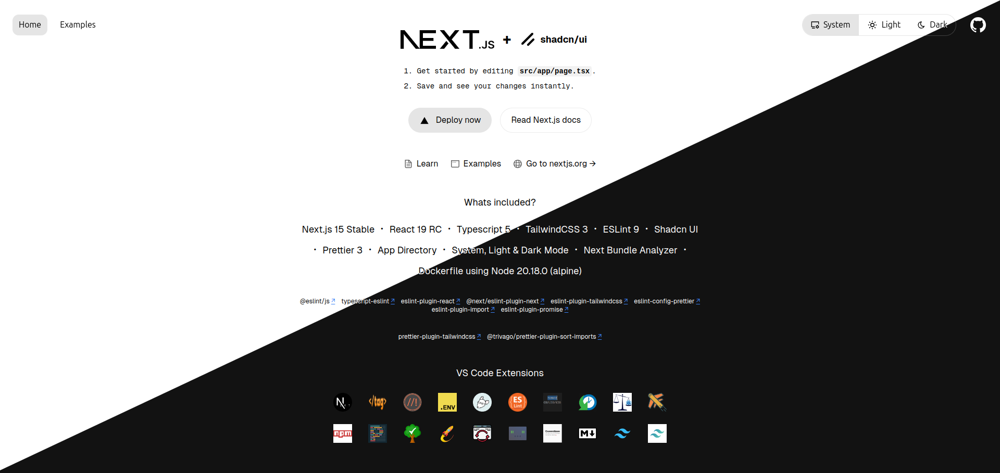

# Next.js 15 Starter (shadcn) [[LIVE DEMO](https://nextjs-15-starter-shadcn.vercel.app/)]

*This is the Tailwind version for Next.js 15 Starter, you may be interested in other templates too -*
- [**Next.js 15 Starter Core**](https://github.com/SiddharthaMaity/nextjs-15-starter-core)
- [**Next.js 15 Starter with Tailwind CSS**](https://github.com/SiddharthaMaity/nextjs-15-starter-tailwind)

Welcome to the **Next.js 15 Starter** repository! This starter template is built with Next.js 15, React 19, TypeScript 5, Tailwind CSS 3, Shadcn UI and comes packed with several powerful tools and configurations to accelerate your project setup and streamline development workflows using VS Code.




## 🚀 What's Included

- **Next.js 15**
- **React 19**
- **TypeScript 5**
- **ESLint 9**
- **Prettier 3**
- **Tailwind CSS 4**
- **Shadcn UI**
- **App Directory**
- **System, Light & Dark Mode**
- **Next.js Bundle Analyzer**
- **Dockerfile** with Node.js 22.14.0 (Alpine)

### 🛠️ ESLint Plugins

- [**@eslint/js**](https://www.npmjs.com/package/@eslint/js)
- [**typescript-eslint**](https://github.com/typescript-eslint/typescript-eslint)
- [**eslint-plugin-react**](https://github.com/jsx-eslint/eslint-plugin-react)
- [**@next/eslint-plugin-next**](https://github.com/vercel/next.js)
- [**eslint-config-prettier**](eslint-config-prettier)
- [**eslint-plugin-tailwindcss**](https://github.com/francoismassart/eslint-plugin-tailwindcss)
- [**eslint-plugin-import**](https://github.com/import-js/eslint-plugin-import)
- [**eslint-plugin-promise**](https://github.com/eslint-community/eslint-plugin-promise)

### ✨ Prettier Plugins

- [**@trivago/prettier-plugin-sort-imports**](https://github.com/trivago/prettier-plugin-sort-imports)
- [**prettier-plugin-tailwindcss**](https://github.com/tailwindlabs/prettier-plugin-tailwindcss)

### 💻 VS Code Extensions (Recommended)

To enhance development experience, install the following VS Code extensions:

- [**Auto Close Tag**](https://marketplace.visualstudio.com/items?itemName=formulahendry.auto-close-tag)
- [**Better Comments**](https://marketplace.visualstudio.com/items?itemName=aaron-bond.better-comments)
- [**DotENV**](https://marketplace.visualstudio.com/items?itemName=mikestead.dotenv)
- [**EditorConfig for VS Code**](https://marketplace.visualstudio.com/items?itemName=EditorConfig.EditorConfig)
- [**ESLint**](https://marketplace.visualstudio.com/items?itemName=dbaeumer.vscode-eslint)
- [**formate: CSS/LESS/SCSS formatter**](https://marketplace.visualstudio.com/items?itemName=MikeBovenlander.formate)
- [**Git History**](https://marketplace.visualstudio.com/items?itemName=donjayamanne.githistory)
- [**Import Cost**](https://marketplace.visualstudio.com/items?itemName=wix.vscode-import-cost)
- [**JavaScript Booster**](https://marketplace.visualstudio.com/items?itemName=sburg.vscode-javascript-booster)
- [**npm Intellisense**](https://marketplace.visualstudio.com/items?itemName=christian-kohler.npm-intellisense)
- [**Prettier - Code formatter**](https://marketplace.visualstudio.com/items?itemName=esbenp)
- [**Todo Tree**](https://marketplace.visualstudio.com/items?itemName=Gruntfuggly.todo-tree)
- [**Turbo Console Log**](https://marketplace.visualstudio.com/items?itemName=ChakrounAnas.turbo-console-log)
- [**Package Json Upgrade**](https://marketplace.visualstudio.com/items?itemName=codeandstuff.package-json-upgrade)
- [**Visual Studio Code Commitizen Support**](https://marketplace.visualstudio.com/items?itemName=KnisterPeter.vscode-commitizen)
- [**Markdown All in One**](https://marketplace.visualstudio.com/items?itemName=yzhang.markdown-all-in-one)


## 🏁 Getting Started

### Prerequisites

- **Node.js**: Version 20.18.0 or higher
- **Docker**: For containerized deployment (optional but recommended)

### Installation

1. **Clone the Repository**:
    ```bash
    git clone https://github.com/yourusername/nextjs-15-starter-shadcn.git
    cd nextjs-15-starter-shadcn
    ```
    To get the code without example change branch to without-example
    ```bash
    git checkout without-example
    ```

2. **Install Dependencies**:
    ```bash
    npm install
    # or with Yarn
    yarn install
    ```

3. **Run Development Server**:
    ```bash
    npm run dev
    # or with Yarn
    yarn dev
    ```

4. **Build for Production**:
    ```bash
    npm run build
    ```

### 🐳 Docker Setup

To use Docker, make sure Docker is installed on your machine. Then, build and run the Docker container:

```bash
docker build . -t nextjs-starter-shadcn
docker run -p 3000:3000 nextjs-starter-shadcn
```

### ☁ Try it in the Cloud

[](https://vscode.dev/github/SiddharthaMaity/nextjs-15-starter-shadcn)

[](https://github.com/codespaces/new?hide_repo_select=true&ref=main&repo=SiddharthaMaity/nextjs-15-starter-shadcn)

[](https://codesandbox.io/s/github/SiddharthaMaity/nextjs-15-starter-shadcn)

[](https://gitpod.io/#https://github.com/SiddharthaMaity/nextjs-15-starter-shadcn)

[](https://stackblitz.com/github/SiddharthaMaity/nextjs-15-starter-shadcn)

[](https://replit.com/github/SiddharthaMaity/nextjs-15-starter-shadcn)

[](https://glitch.com/edit/#!/import/github/SiddharthaMaity/nextjs-15-starter-shadcn)

### License

This project is licensed under the MIT License. See the [LICENSE](LICENSE) file for details.
