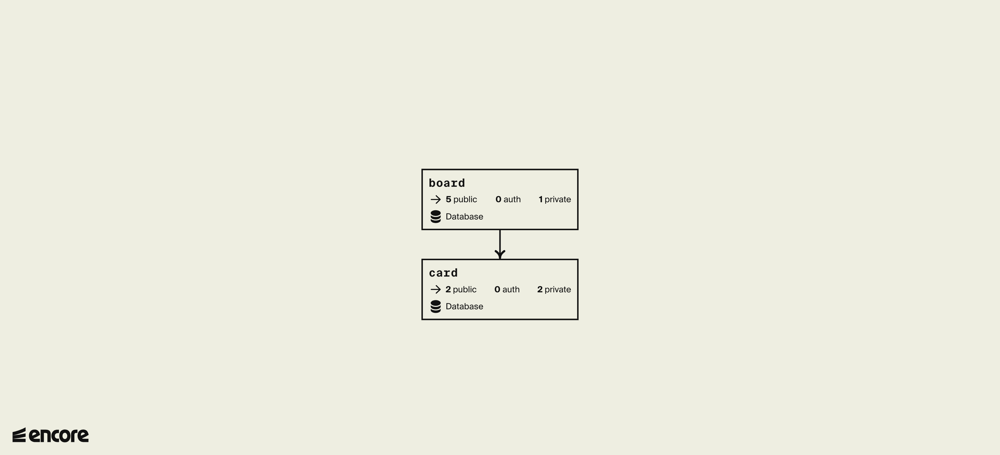

# Trello Clone

This is a backend for a Trello application, built using Encore.
It has two services, each with a couple of API endpoints and their own databases.

This example is intended to show how you create microservices applications with Encore. However, Encore can just as easily be used to build monolithic architectures.



## Developing locally

When you have installed Encore, you can create a new Encore application and clone this example with this command.

```bash
encore app create my-app-name --example=trello-clone
```

## Defining services

With Encore you define a service by [defining one or more APIs](https://encore.dev/docs/primitives/services-and-apis#defining-apis) within a regular Go package. Encore recognizes this as a service, and uses the package name as the service name. When deploying, Encore will automatically [provision the required infrastructure](https://encore.dev/docs/deploy/infra) for each service.

## Using Databases with Encore

Encore treats SQL databases as logical resources and natively supports **PostreSQL** databases.
To start using a database you only need to [define the schema](https://encore.dev/docs/primitives/databases#defining-a-database-schema) by creating a migration file. Encore takes care of [provisioning the database](https://encore.dev/docs/primitives/databases#provisioning-databases), running new schema migrations during deploys, and connecting to it.

### Defining database schemas

Database schemas are defined by creating *migration files* in a directory named `migrations`
within an Encore service package. As you can see in this example, the data base schema is defined in the migration file `1_create_table.up.sql`.

## Running

To run the application locally, make sure you have [Docker](https://docker.com) installed and running. This is required to run Encore applications with SQL databases.

```bash
# Run the app
encore run
```

## Using the API

To see that your app is running, you can ping the `board.Create` endpoint to create a trello board.

```bash
curl 'http://localhost:4000/board.Create' -d '{"Name":"my board"}'
```

## Open the developer dashboard

While `encore run` is running, open <http://localhost:9400/> to view Encore's local developer dashboard.
Here you can see the request you just made and a view a trace of the response.

## Deployment

Deploy your application to a staging environment in Encore's free development cloud.

```bash
git push encore
```

Then head over to <https://app.encore.dev> to find out your production URL, and off you go into the clouds!
