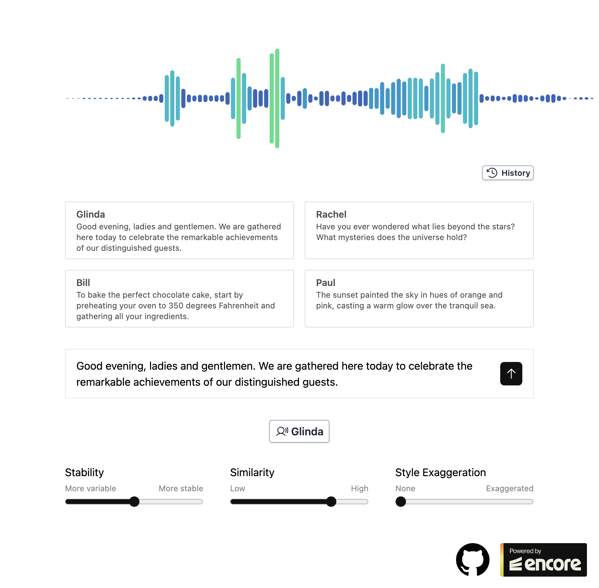
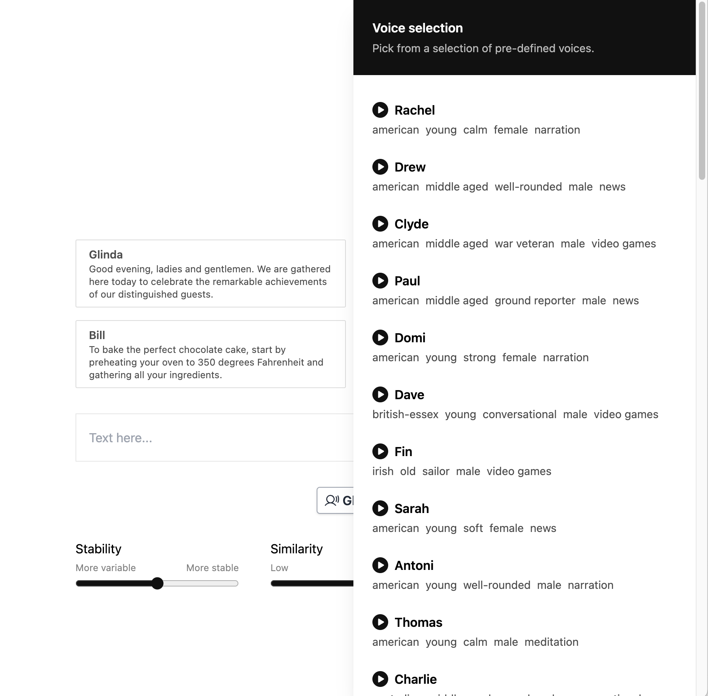

# ElevenLabs Generative AI Text-to-Speech

Try your hand at AI app development with this Encore for TypeScript example app, implementing an AI powered text-to-speech generator.

This fun web app project lets you create your own text-to-speech app, powered by ElevenLabs' cutting-edge API for generative voice AI.

It's a great way to experiment with the latest in AI technology and enhance your developer skills.

Ready to bring your text to life?

Generate and play audio:


Select from different voices:


## Developing locally

When you have [installed Encore](https://encore.dev/docs/ts/install), you can create a new Encore application and clone this example with this command.

```bash
encore app create my-app-name --example=ts/elevenlabs
```

## ElevenLabs API Key

You will need an [API key from ElevenLabs](https://docs.elevenlabs.io/api-reference/quick-start/authentication) to use this package. You can get one by signing up for a free account at https://elevenlabs.io/.

Once you have the API key, set it as an Encore secret using the name `ElevenLabsAPIKey`:

```bash
$ encore secret set --type dev,prod,local,pr ElevenLabsAPIKey
Enter secret value: *****
Successfully updated development secret ElevenLabsAPIKey.
```

## Running locally
```bash
encore run
```

While `encore run` is running, open [http://localhost:4000](http://localhost:4000) to view the ElevenLabs playground frontend.

You can also access Encore's [local developer dashboard](https://encore.dev/docs/ts/observability/dev-dash) on <http://localhost:9400/> to view traces, API documentation, and more.

## Deployment

Deploy your application to a staging environment in Encore's free development cloud:

```bash
git add -A .
git commit -m 'Commit message'
git push encore
```

Then head over to the [Cloud Dashboard](https://app.encore.dev) to monitor your deployment and find your production URL.

From there you can also connect your own AWS or GCP account to use for deployment.

Now off you go into the clouds!
