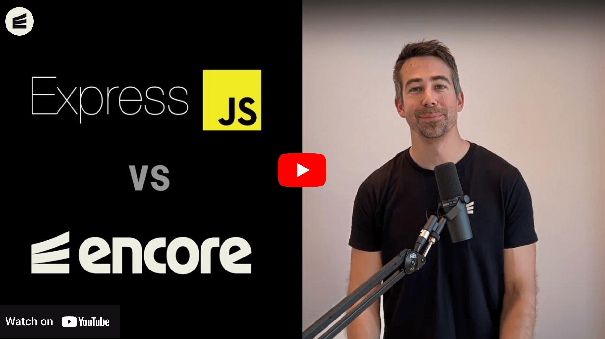

# Express.js migration guide

Express.js is a popular web framework for Node.js. It's been around for a long time and has a large community of
developers. Encore.ts is a new web framework that aims to make it easier to build robust and type-safe backends with TypeScript.

A complete guide can be found in the [Migrate from Express.js](https://encore.dev/docs/ts/migration/express-migration) docs.

## Full migration

In the `express` folder, you'll find an example Express.js app. In the `encore` folder, you'll find the same app, but built with Encore.ts.

Let this example serve as a reference guide if you are migrating your Express.js app over to Encore.ts or if you are already familiar with Express.js and want to see how Encore.ts compares.

The example apps showcase the following features:
- **GET requests** - Handling dynamic path params and receiving query params
- **POST requests** - Receiving JSON data
- **Request schema validation** - Validate incoming requests 
- **Error handling** - Returning errors with status codes
- **Database connection** - Connecting to and using a PostgreSQL database for querying and inserting
- **Microservice communication** - Making requests to another service
- **Authentication** - Using an auth handler middleware
- **Serving static assets** - Serving static files like HTML and CSS
- **Using a template engine** - Rendering HTML with dynamic data

## Forklift migration (quick start)

In the `forklift-migration` folder, you'll find an example of how you can incrementally move over an existing Express.js app to Encore.ts by creating a catch-all handler for your HTTP router. This is done by mounting your existing app router under a Raw endpoint.

