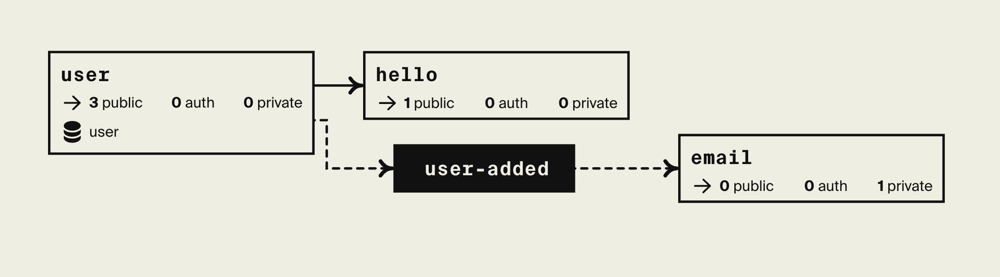

# Simple Event-Driven Application

This is a simple starter (three services) with an event-driven architecture. It utilizes: 
* APIs
* Database
* Pub/Sub
* Secrets



YouTube video describing this example: [here](https://www.youtube.com/watch?v=vvqTGfoXVsw).

## Developing locally

When you have [installed Encore](https://encore.dev/docs/install), you can create a new Encore application and clone this example with this command.

```bash
encore app create my-app-name --example=ts/simple-event-driven
```

## Running locally
```bash
encore run
```

To use the SendGrid integration, set the SendGrid API key:
```bash
encore secret set SendGridAPIKey
```

While `encore run` is running, open <http://localhost:9400/> to view Encore's [local developer dashboard](https://encore.dev/docs/observability/dev-dash).

## Using the API

To see that your app is running, you can ping the API.

```bash
curl http://localhost:4000/hello/World
```

## Deployment

Deploy your application to a staging environment in Encore's free development cloud:

```bash
git add -A .
git commit -m 'Commit message'
git push encore
```

Then head over to the [Cloud Dashboard](https://app.encore.dev) to monitor your deployment and find your production URL.

From there you can also connect your own AWS or GCP account to use for deployment.

Now off you go into the clouds!

## Testing

```bash
encore test
```
