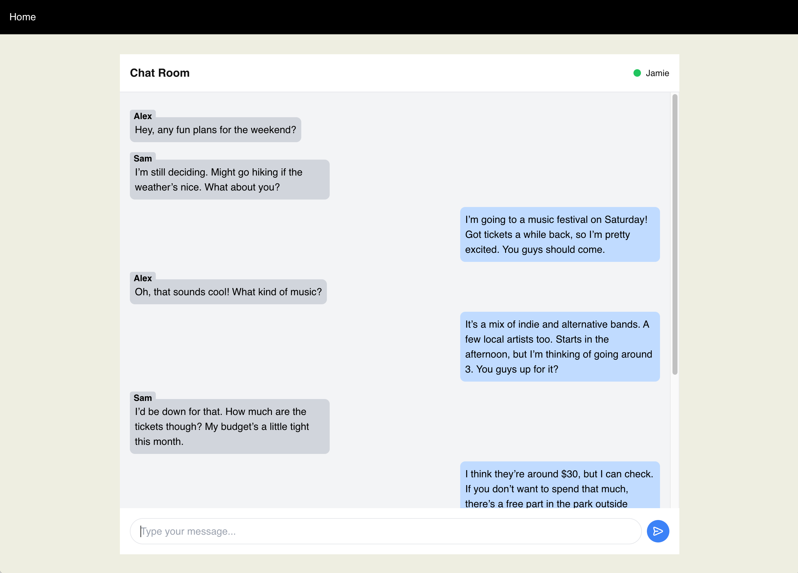

# Encore.ts Streaming Chat Example

This is an example of how to use the Streaming API in Encore.ts to create a WebSocket stream from a web frontend to a Encore.ts backend.

Learn more in our [Streaming API docs](https://encore.dev/docs/ts/primitives/streaming-apis)



## Developing locally
### Prerequisite: Installing Encore

If this is the first time you're using Encore, you first need to install the CLI that runs the local development
environment. Use the appropriate command for your system:

- **macOS:** `brew install encoredev/tap/encore`
- **Linux:** `curl -L https://encore.dev/install.sh | bash`
- **Windows:** `iwr https://encore.dev/install.ps1 | iex`

When you have installed Encore, run to clone this example:

```bash
encore app create --example=ts/streaming-chat
```

## Running locally
```bash
encore run
```

While `encore run` is running, open <http://localhost:4000/> to view the chat frontend. Open <http://localhost:4000/> in multiple tabs to see the chat in action. 

You can also access Encore's [local developer dashboard](https://encore.dev/docs/ts/observability/dev-dash) on <http://localhost:9400/> to view traces, API documentation, and more.

In you change the frontend then run `npm run build` to build a new frontend in the `dist` folder.

## Testing

```bash
encore test
```

## Deployment

Deploy your application to a staging environment in Encore's free development cloud:

```bash
git add -A .
git commit -m 'Commit message'
git push encore
```

Then head over to the [Cloud Dashboard](https://app.encore.dev) to monitor your deployment and find your production URL.

From there you can also connect your own AWS or GCP account to use for deployment.

Now off you go into the clouds!
