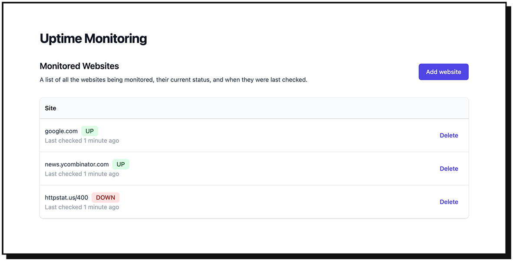
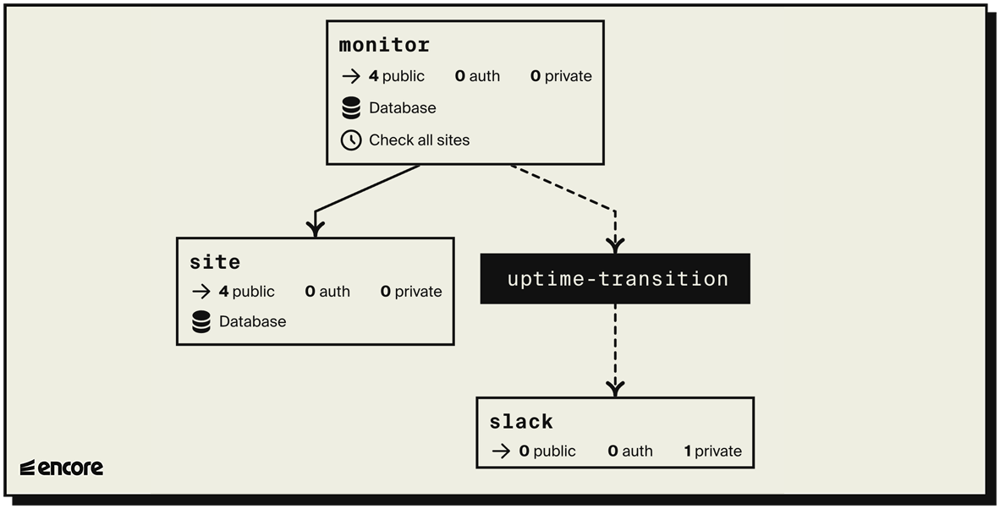

# Uptime Monitoring System

This is an Encore application that continuously monitors the uptime of a list of websites.

When it detects a website going down it posts a Slack message notifying that the website is down, and another message when the website is back up again.




## Tutorial

Check out the [written tutorial](https://encore.dev/docs/tutorials/uptime) to learn how to build this application from scratch!

## Developing locally

When you have installed Encore, you can create a new Encore application and clone this example with this command.

```bash
encore app create my-app-name --example=uptime
```

## Running

```bash
# Run the app
encore run

# To use the Slack integration, set the Slack Webhook URL (see tutorial above).
encore secret set SlackWebhookURL
```

## View the frontend
While `encore run` is running, head over to <http://localhost:4000/frontend/> to view the frontend.

## Using the API

```bash
# Check if a given site is up (defaults to 'https://' if left out)
curl 'http://localhost:4000/ping/google.com'

# Add a site to be automatically pinged every 5 minutes
curl 'http://localhost:4000/site' -d '{"url":"google.com"}'

# Check all tracked sites immediately
curl -X POST 'http://localhost:4000/checkall'

# Get the current status of all tracked sites
curl 'http://localhost:4000/sites'
```

## Deployment

```bash
git push encore
```

Then head over to <https://app.encore.dev> to find out your production URL, and off you go into the clouds!

## Testing

```bash
encore test ./...
```